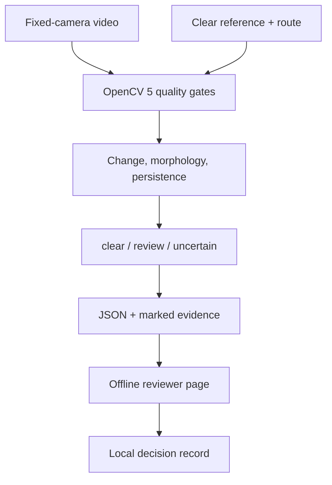
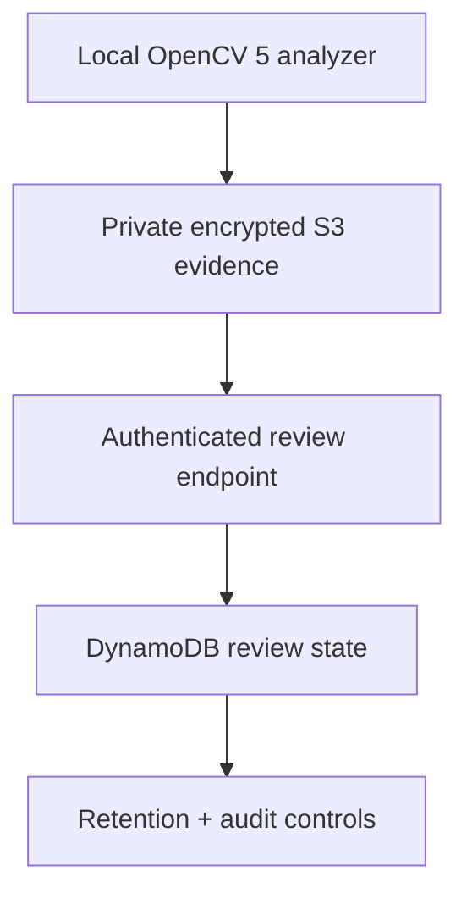

# ClearRoute — OpenCV AI Competition submission draft

Status: **working local prototype; not submission-ready**. Verified against the official overview and rules on 2026-10-06.

Official sources: [overview](https://opencv26.devpost.com/) and [rules](https://opencv26.devpost.com/rules).

## Short description

ClearRoute is a human-in-the-loop fixed-camera tool for reviewing persistent obstruction of a configured emergency exit or accessible route. OpenCV 5 compares video frames with a clear reference, measures changed area inside the route, applies persistence and image-quality gates, and exports a timestamped evidence frame. Poor light, camera movement, major occlusion and reflection-like fluctuation produce `uncertain`, not an automatic safety conclusion. A reviewer receives a self-contained offline report and can record a bounded decision. ClearRoute does not identify people, infer intent or replace physical safety inspections.

## Problem and users

Temporary storage, deliveries or moved furniture can obstruct marked paths. Continuous manual observation is difficult, while identity-based surveillance is unnecessary. The intended user is a facilities or safety reviewer who already has authority to inspect a consented fixed-camera view. The prototype only prioritizes visual evidence for review.

## Implemented architecture

Implemented locally: OpenCV 5.0.0.93, synthetic AVI generator, CLI analysis, evidence timestamp/PNG, offline HTML review, local decision JSON, and a boto3-compatible AWS publishing contract tested only with fake clients. No live cloud component is represented as deployed or validated.

## Proposed AWS architecture — not implemented or validated

The minimum meaningful AWS target is private encrypted evidence storage, authenticated retrieval, and persisted review state. IAM least privilege, retention, deletion, observability, deployment and cost must be implemented and exercised before submission. No AWS resources have been created or charged.

## Current evaluation

- 23 automated tests pass on generated fixtures and fake AWS clients using Python 3.12, NumPy 2.3.5 and OpenCV 5.0.0.93.
- Cases include persistent, transient, intermittent and outside-route changes; poor light; global occlusion; camera shift/drift/vibration; simple shadow; flickering reflection; stable white obstruction; and obstruction with glare.
- Encoded AVI tests distinguish the current synthetic reflection from stable white/glare obstruction.
- This is synthetic feasibility evidence only. It is not precision/recall measurement or real-camera validation.

## Limitations and responsible use

- No consented real footage, varied sites, crowds, weather, changed furniture or damaged/compressed feeds have been evaluated.
- Reflection handling is a hand-designed brightness/saturation/temporal heuristic, not reflection understanding.
- The route is currently a configured rectangle rather than an interactive polygon calibration flow.
- Thresholds are not calibrated per camera; false alerts and missed blockages remain possible.
- ClearRoute must not be the sole emergency-access control and must never automatically accuse, punish or identify a person.
- The prototype stores no reviewer identity and sends no external alert.

## Five-minute demo script

1. **0:00–0:30 — Problem and boundary:** show the configured route; state that the tool prioritizes evidence for a human and is not a safety controller.
2. **0:30–1:05 — Architecture:** show OpenCV 5 quality gates, persistence, evidence export and the planned-but-incomplete AWS layer.
3. **1:05–2:05 — Persistent obstruction:** generate fixtures, analyze the persistent box, show `review_required`, timestamp and marked frame.
4. **2:05–2:50 — Harmless motion:** run transient, intermittent and outside-route cases; show `clear` results.
5. **2:50–3:35 — Failure handling:** run poor light, camera vibration and reflection; show `uncertain` rather than a confident alert.
6. **3:35–4:10 — Human review:** open the self-contained HTML and record a local `confirmed_obstruction`, `dismissed` or `needs_follow_up` decision.
7. **4:10–4:40 — Test evidence:** run the suite and show the synthetic report, explicitly distinguishing test count from real accuracy.
8. **4:40–5:00 — Honest gaps:** state that AWS deployment and real-footage validation remain incomplete unless finished before recording.

## Verified competition facts and unresolved terms

- Page deadline: **2026-10-26 11:45 p.m. PDT**; overview prose says 11:59 p.m. Pacific. Use 11:45 p.m. PDT as the internal cutoff.
- Every entry must use OpenCV 5 substantively and run a meaningful component on AWS.
- Required deliverables include a technical report, judge-accessible code/archive, pinned build/deploy/test instructions, architecture diagram, working endpoint or arranged screen-share, judge-accessible video no longer than five minutes, and evaluation evidence including failures.
- Overall judging: technical execution 30%, innovation 20%, impact 20%, UX 10%, documentation 10%, and cloud/reproducibility/responsible operation 10%.
- Cash awards listed in the rules total $12,000: $5,000 / $3,000 / $2,000 overall plus two $1,000 special awards. The overview's $20,250 headline includes compute grants.
- Eligibility text says age 13 minimum, with guardian permission below local majority; the user self-reports being above 18. Overview says countries are accepted except standard exceptions. India is not specifically excluded on the visible page, but eligibility must be confirmed during registration.
- Team size is not stated on the visible overview/rules page: **unknown**.
- Pre-existing-code/reuse restrictions are not stated on the visible page. Participants retain underlying IP, must hold rights to submitted materials, and grant broad rights to submitted materials. Confirm reuse terms before submission.

## Remaining submission gate

- [x] Runnable OpenCV 5 CLI and generated fixtures.
- [x] Evidence timestamp and marked frame.
- [x] Offline reviewer page and local decision record.
- [x] Pinned local dependencies and 21 passing synthetic tests.
- [x] Documented synthetic failures/limitations.
- [x] Fake-client-tested S3/DynamoDB publishing contract.
- [ ] Implement and exercise a meaningful AWS component.
- [ ] Provide reproducible AWS deployment, IAM, retention, observability and teardown instructions.
- [ ] Validate on consented real fixed-camera footage and report failures/metrics.
- [ ] Produce a working endpoint or arrange the permitted live screen-share.
- [ ] Record a judge-accessible video of at most five minutes.
- [ ] Confirm India eligibility, team-size rules, reuse rules and final registration terms.
- [ ] Complete registration, accept terms and submit — user action only; not authorized here.

Do not describe this project as submission-ready until every unchecked technical and eligibility item is resolved.
